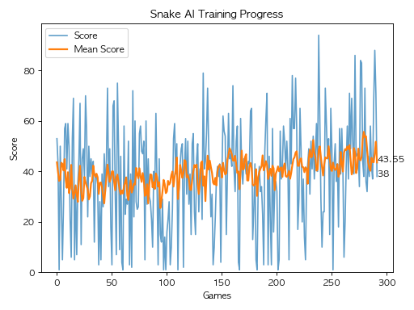

# Snake AI — PPO 강화학습 에이전트

Snake 게임을 스스로 학습하는 강화학습 AI입니다.
Stable-Baselines 등 외부 RL 라이브러리 없이 PPO 알고리즘을 직접 구성했습니다.



---

## 성과

| 항목 | 값 |
|------|-----|
| 최고 점수 | **64** |
| 최근 20게임 평균 | **28 ~ 30** |
| 총 학습 스텝 | **8,600,000+** |
| 총 학습 게임 수 | **36,000+** |

---

## 기술 스택

`Python` `PyTorch` `NumPy` `pygame` `multiprocessing`

---

## 개발 배경

처음에는 **11차원 상태 표현 + DQN** 방식으로 시작했습니다.

- 11차원 방식: 빠르게 평균 20에 도달했지만 이후 성장이 없었습니다.
- DQN: 느리지만 꾸준히 성장했으나 결국 한계에 부딪혔습니다.

두 방식의 한계를 직접 경험한 후 **CNN 기반 상태 표현 + PPO**로 전환했고 지속적인 성장을 확인했습니다.

---

## 구현 내용

### PPO (Proximal Policy Optimization)

- **Clipped Surrogate Objective**: `clip_epsilon=0.2`로 정책 업데이트 크기를 제한해 학습 안정성 확보
- **GAE** (Generalized Advantage Estimation): `λ=0.95`로 편향-분산 균형 조절
- **Entropy Bonus**: `entropy_coeff=0.08`로 탐험 유지
- **done / truncated 분리**: 타임아웃과 실제 충돌 종료를 구분해 GAE 계산 오류 방지
- **LR Linear Annealing**: 학습 진행에 따라 학습률 선형 감소

### CNN Actor-Critic 네트워크

게임 상태를 **7채널 그리드(24×32)**로 표현합니다.

| 채널 | 의미 |
|------|------|
| 0 | 뱀 몸통 |
| 1 | 뱀 머리 |
| 2 | 음식 위치 |
| 3 ~ 6 | 현재 방향 (one-hot) |

```
Conv2d(7→32) → MaxPool → Conv2d(32→64) → MaxPool → FC(256)
                                                      ├── Policy Head → 3 actions
                                                      └── Value Head  → scalar
```

### 멀티프로세스 병렬 환경

`multiprocessing.Process` + `Pipe` 기반 `SubprocVecEnv`를 구현했습니다.

- 8개 환경이 각각 독립 프로세스에서 동시 실행
- 데이터 다양성 확보 및 학습 효율 향상

### 보상 함수

| 상황 | 보상 |
|------|------|
| 음식 획득 | +1.0 |
| 충돌 (사망) | -1.0 |
| 음식에 가까워짐 | +0.01 |
| 음식에서 멀어짐 | -0.01 |

---

## 학습 성장 과정

| 학습 회차 | 방식 | 최고기록 | 평균 |
|---------|------|---------|------|
| 1차 (3M 스텝) | PPO, n_steps=128 | 39 | ~15 |
| 2차 (3M 스텝) | reset-steps | 56 | ~26 |
| 3차 (3M 스텝) | reset-steps, n_steps=256 | **64** | **~30** |

---

## 실행 방법

### 설치
```bash
pip install torch pygame numpy matplotlib
```

### 학습된 모델 실행 (관람)
```bash
python play.py           # 무한 반복
python play.py --games 5 # 5게임 관람
```

### 학습
```bash
# 기본 학습
python main.py --no-render

# 체크포인트에서 이어서 학습 (LR 초기화)
python main.py --no-render --reset-steps

# n_steps 조정
python main.py --no-render --reset-steps --n-steps 256

# 단일 프로세스 모드 (렌더링 포함)
python main.py --no-multiprocess
```

### 주요 옵션

| 옵션 | 기본값 | 설명 |
|------|--------|------|
| `--n-envs` | 8 | 병렬 환경 수 |
| `--n-steps` | 128 | rollout 길이 |
| `--total-timesteps` | 3,000,000 | 총 학습 스텝 |
| `--lr` | 1e-4 | 학습률 |
| `--entropy-coeff` | 0.08 | 엔트로피 계수 |

---

## 프로젝트 구조

```
snake-ai/
├── game.py             # Snake 게임 환경 (pygame)
├── model.py            # CNN Actor-Critic 네트워크
├── agent.py            # PPO 에이전트 + RolloutBuffer + GAE
├── vec_env.py          # 단일 프로세스 벡터화 환경
├── subproc_vec_env.py  # 멀티프로세스 벡터화 환경
├── main.py             # 학습 루프
├── play.py             # 학습된 모델 플레이 관람
└── benchmark.py        # 성능 프로파일링
```
